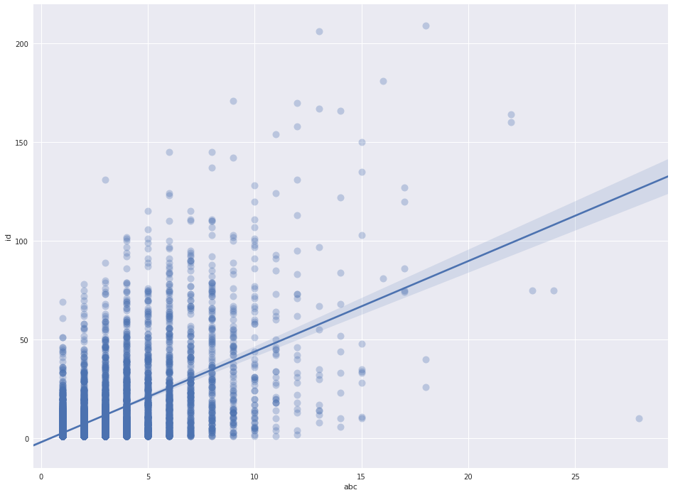

Title: Irish Folk Music Analysis  
Date: 2018-04-09 12:15
Modified: 2018-04-09 12:15
Category: music
Tags: music, tunes
Slug: Irish-folk-music-analysis
Authors: Gremlin
Summary: A brief analysis of the Irish instrumental tune data from thesession.org.


```python
# All the library imports 
import numpy as np
import seaborn as sns
import matplotlib.pyplot as plt
import pandas as pd 
import re 
import itertools 
```


```python
# All the settings  
pd.set_option('display.max_colwidth', -1) 

import warnings
warnings.filterwarnings('ignore') 
```


```python
# Get the tune, recordjing and alias data into dataframes 
tuneData = pd.read_json('/data/tunes.json')
print(type(tuneData))

aliasData = pd.read_json('/data/aliases.json')
print(type(aliasData))

recordData = pd.read_json('/data/recordings.json')
print(type(recordData)) 
```

    <class 'pandas.core.frame.DataFrame'>
    <class 'pandas.core.frame.DataFrame'>
    <class 'pandas.core.frame.DataFrame'>


```python
# Print out some rows 
tuneData.head(3) 
```


<div>
<style scoped>
    .dataframe tbody tr th:only-of-type {
        vertical-align: middle;
    }

    .dataframe tbody tr th {
        vertical-align: top;
    }

    .dataframe thead th {
        text-align: right;
    }
</style>
<table border="1" class="dataframe">
  <thead>
    <tr style="text-align: right;">
      <th></th>
      <th>abc</th>
      <th>date</th>
      <th>meter</th>
      <th>mode</th>
      <th>name</th>
      <th>setting</th>
      <th>tune</th>
      <th>type</th>
      <th>username</th>
    </tr>
  </thead>
  <tbody>
    <tr>
      <th>0</th>
      <td>dBB B2 A BAG|dBB Bcd efg|dBB B2 A BAG| eAA dBG A2 e| \r\ndBB B2 A BAG|dBB Bcd efg|dBB B2 A BAG| eAA dBG A2 A|\r\nBAB g2 e fed|BAB e/f/g e f2 A|BAB g2 e fed|eAA ABd e2 A|\r\nBAB g2 e fed|BAB e/f/g e f2 f|def gfe fed |eAA ABd efg|</td>
      <td>2012-05-16 23:49:26</td>
      <td>9/8</td>
      <td>Gmajor</td>
      <td>'G Iomain Nan Gamhna</td>
      <td>11931</td>
      <td>11931</td>
      <td>slip jig</td>
      <td>iliketurtles</td>
    </tr>
    <tr>
      <th>1</th>
      <td>|: G&gt;A B&gt;G c&gt;A B&gt;G | E&lt;E A&gt;G F&lt;D D2 | G&gt;A B&gt;G c&gt;A B&gt;G | E&gt;A F&gt;D G2 G2 :|\r\n|: D&gt;D D&gt;D (3DDD D&gt;D | d&gt;B A&gt;B G&lt;E E2 | D&gt;D D&gt;D (3DDD D&gt;D | d&gt;B A&gt;B G2 G2 :|</td>
      <td>2016-03-31 07:34:45</td>
      <td>4/4</td>
      <td>Gmajor</td>
      <td>'S Ann An Ìle</td>
      <td>28560</td>
      <td>15326</td>
      <td>strathspey</td>
      <td>Daniel Quayle</td>
    </tr>
    <tr>
      <th>2</th>
      <td>uD2|:{F}v[G,2G2]uB&gt;ud c&gt;A B&gt;G|{D}E2 uA&gt;uG F&lt;D D&gt;F|{F}[G,2G2]uB&gt;ud c&gt;A B&gt;G|[1E&gt;A F&lt;D {F}G2 uG&gt;uD:|[2E&gt;A F&lt;D {F}G2 (G&gt;E)|\r\nD&gt;D D&gt;B, D&gt;D D&gt;(B|d&gt;B) A&gt;B G&lt;E E&gt;G|D&gt;D D&gt;B, D&gt;D D&gt;(B|[1d&gt;B) A&lt;B {F}G2 G&gt;E:|[2d&gt;B) A&lt;B {F}G2||</td>
      <td>2016-04-03 01:15:08</td>
      <td>4/4</td>
      <td>Gmajor</td>
      <td>'S Ann An Ìle</td>
      <td>28582</td>
      <td>15326</td>
      <td>strathspey</td>
      <td>DonaldK</td>
    </tr>
  </tbody>
</table>
</div>


```python
recordData.head(3) 
```


<div>
<style scoped>
    .dataframe tbody tr th:only-of-type {
        vertical-align: middle;
    }

    .dataframe tbody tr th {
        vertical-align: top;
    }

    .dataframe thead th {
        text-align: right;
    }
</style>
<table border="1" class="dataframe">
  <thead>
    <tr style="text-align: right;">
      <th></th>
      <th>artist</th>
      <th>field10</th>
      <th>field11</th>
      <th>field8</th>
      <th>field9</th>
      <th>id</th>
      <th>number</th>
      <th>recording</th>
      <th>track</th>
      <th>tune</th>
      <th>tune_id</th>
    </tr>
  </thead>
  <tbody>
    <tr>
      <th>0</th>
      <td>1651</td>
      <td>NaN</td>
      <td>NaN</td>
      <td>NaN</td>
      <td>NaN</td>
      <td>3720</td>
      <td>1</td>
      <td>Cast A Bell</td>
      <td>1</td>
      <td>Kettledrum</td>
      <td>14408</td>
    </tr>
    <tr>
      <th>1</th>
      <td>1651</td>
      <td>NaN</td>
      <td>NaN</td>
      <td>NaN</td>
      <td>NaN</td>
      <td>3720</td>
      <td>1</td>
      <td>Cast A Bell</td>
      <td>2</td>
      <td>Maiden Lane</td>
      <td>13727</td>
    </tr>
    <tr>
      <th>2</th>
      <td>1651</td>
      <td>NaN</td>
      <td>NaN</td>
      <td>NaN</td>
      <td>NaN</td>
      <td>3720</td>
      <td>2</td>
      <td>Cast A Bell</td>
      <td>2</td>
      <td>Chirping Of The Nightingale</td>
      <td>NULL</td>
    </tr>
  </tbody>
</table>
</div>


```python
numSettings = tuneData.groupby(['name', 'tune'])['abc'].count().reset_index().rename(index=str, columns={"tune": "tune_id"}) 
```


```python
numRecordings = recordData.groupby(['tune_id'])['id'].count().reset_index() 
```


```python
numRecordings = numRecordings[numRecordings.tune_id.apply(lambda x: x.isnumeric())] 
numRecordings[['tune_id']] = numRecordings[['tune_id']].astype(int) 
```


```python
joinData = numSettings.join(numRecordings.set_index('tune_id'), on='tune_id').dropna(how='any')  
```


```python
import seaborn as sns; sns.set(color_codes=True) 
import matplotlib.pyplot as plt 
sns.set(rc={"figure.figsize": (16, 12)}) 
ax = sns.regplot(x="abc", y="id", data=joinData, scatter_kws={"s": 100,  "alpha": 0.3}) 
```





```python
jigdf = (tuneData.loc[tuneData['type']=='reel'])
```


```python
notes = ['G,', 'A,', 'B,', 'C', 'D', 'E', 'F', 'G', 'A', 'B', 'c', 'd', 'e', 'f', 'g', 'a', 'b', 'c\'', 'd\''] 
```


```python
rep = dict();

for n in notes:
    rep[n+"2"] = n * 2
    rep[n+"3"] = n * 3
    rep[n+"4"] = n * 4
```


```python
rep = dict((re.escape(k), v) for k, v in rep.items())
pattern = re.compile("|".join(rep.keys()))
```


```python
for index, row in jigdf.iterrows():
    row[0] = re.sub('(?:[{\"]{1,2}\w*[}\"]{1,2})', '', row[0]) 
    row[0] = re.sub('[^a-gA-G,:|\']', '', pattern.sub(lambda m: rep[re.escape(m.group(0))], row[0]))
    jigdf.set_value(index, 'abc1', row[0]) 
```


```python
pattern1 = re.compile(r'[|:]{0,2}(?:[a-gA-G][,\'\s]{0,2}){3}(?:[a-gA-G][,\'\s]{0,2}){3}[:|]{0,2}') 
```


```python
for index, row in jigdf.iterrows():
    basic = ''
    i = 0 
    for match in re.findall(pattern1, row[9]) :
        basic = basic + re.sub('[^a-gA-G,\']', '', match) + "|" 
        i = i + 1
        if i >= 8:
            break
    jigdf.loc[index, 'basic'] = basic 
```


```python
sample = jigdf[jigdf['name'].str.contains("Kesh, The")&jigdf['mode'].str.contains("Gmajor")]
```


```python
sample.count() 
```


    abc         8
    date        8
    meter       8
    mode        8
    name        8
    setting     8
    tune        8
    type        8
    username    8
    abc1        8
    basic       8
    dtype: int64


```python
df1 = sample['basic'].apply(lambda x: pd.Series(list(x)))
```


```python
num = dict();

i = 0 
for n in notes:
    num[n] = i
    i = i + 1
```


```python
num = dict((re.escape(k), v) for k, v in num.items())
pattern_num = re.compile("|".join(num.keys())) 
```


```python
df1.replace(num, inplace=True)
```


```python
print(df1)
```

           0  1  2   3  4  5  6   7   8   9 ...  46  47  48  49  50  51  52  53  \
    14690  7  7  7  7   8  9  |  8   8   8  ...  11  11  |   9   8   6   7   7    
    14692  7  7  7  7   8  9  |  8   8   8  ...  11  9   |   9   9   9   11  9    
    14696  7  7  4  7   8  9  |  8   8   7  ...  11  9   |   9   9   8   7   7    
    14697  7  7  7  7   7  8  |  8   8   8  ...  14  11  |   8   7   6   7   7    
    14698  7  7  7  7   8  9  |  8   8   8  ...  11  9   |   10  8   6   7   7    
    14699  9  7  7  11  7  7  |  12  14  12 ...  14  15  |   16  14  14  14  14   
    14700  7  7  7  7   8  9  |  8   9   8  ...  11  9   |   9   9   9   11  9    
    14701  7  7  7  7   8  9  |  8   8   8  ...  11  9   |   8   7   6   7   7    
    
           54  55  
    14690  7   |   
    14692  10  |   
    14696  7   |   
    14697  8   |   
    14698  7   |   
    14699  11  |   
    14700  11  |   
    14701  4   |   
    
    [8 rows x 56 columns]


```python
df2 = df1.select_dtypes(['number']) 
```


```python
df2
```


<div>
<style scoped>
    .dataframe tbody tr th:only-of-type {
        vertical-align: middle;
    }

    .dataframe tbody tr th {
        vertical-align: top;
    }

    .dataframe thead th {
        text-align: right;
    }
</style>
<table border="1" class="dataframe">
  <thead>
    <tr style="text-align: right;">
      <th></th>
      <th>0</th>
      <th>1</th>
      <th>2</th>
      <th>3</th>
      <th>4</th>
      <th>5</th>
      <th>7</th>
      <th>8</th>
      <th>9</th>
      <th>10</th>
      <th>...</th>
      <th>39</th>
      <th>42</th>
      <th>43</th>
      <th>44</th>
      <th>45</th>
      <th>50</th>
      <th>52</th>
      <th>56</th>
      <th>57</th>
      <th>60</th>
    </tr>
  </thead>
  <tbody>
    <tr>
      <th>4456</th>
      <td>10</td>
      <td>10</td>
      <td>10</td>
      <td>9</td>
      <td>8</td>
      <td>7</td>
      <td>8</td>
      <td>7</td>
      <td>5</td>
      <td>4</td>
      <td>...</td>
      <td>7</td>
      <td>7</td>
      <td>5</td>
      <td>4</td>
      <td>9</td>
      <td>8</td>
      <td>8</td>
      <td>4.0</td>
      <td>5.0</td>
      <td>9.0</td>
    </tr>
    <tr>
      <th>4457</th>
      <td>10</td>
      <td>9</td>
      <td>8</td>
      <td>15</td>
      <td>13</td>
      <td>15</td>
      <td>16</td>
      <td>15</td>
      <td>14</td>
      <td>12</td>
      <td>...</td>
      <td>11</td>
      <td>7</td>
      <td>9</td>
      <td>11</td>
      <td>14</td>
      <td>8</td>
      <td>8</td>
      <td>NaN</td>
      <td>NaN</td>
      <td>NaN</td>
    </tr>
    <tr>
      <th>4459</th>
      <td>10</td>
      <td>9</td>
      <td>8</td>
      <td>9</td>
      <td>8</td>
      <td>7</td>
      <td>8</td>
      <td>7</td>
      <td>5</td>
      <td>4</td>
      <td>...</td>
      <td>9</td>
      <td>8</td>
      <td>8</td>
      <td>5</td>
      <td>5</td>
      <td>9</td>
      <td>8</td>
      <td>NaN</td>
      <td>NaN</td>
      <td>NaN</td>
    </tr>
    <tr>
      <th>4460</th>
      <td>10</td>
      <td>10</td>
      <td>8</td>
      <td>9</td>
      <td>8</td>
      <td>7</td>
      <td>8</td>
      <td>7</td>
      <td>5</td>
      <td>4</td>
      <td>...</td>
      <td>9</td>
      <td>8</td>
      <td>7</td>
      <td>8</td>
      <td>5</td>
      <td>9</td>
      <td>15</td>
      <td>NaN</td>
      <td>NaN</td>
      <td>NaN</td>
    </tr>
    <tr>
      <th>4461</th>
      <td>8</td>
      <td>7</td>
      <td>5</td>
      <td>4</td>
      <td>9</td>
      <td>7</td>
      <td>8</td>
      <td>7</td>
      <td>8</td>
      <td>5</td>
      <td>...</td>
      <td>11</td>
      <td>11</td>
      <td>12</td>
      <td>14</td>
      <td>15</td>
      <td>10</td>
      <td>10</td>
      <td>11.0</td>
      <td>12.0</td>
      <td>16.0</td>
    </tr>
    <tr>
      <th>4462</th>
      <td>10</td>
      <td>10</td>
      <td>10</td>
      <td>9</td>
      <td>8</td>
      <td>7</td>
      <td>8</td>
      <td>7</td>
      <td>5</td>
      <td>4</td>
      <td>...</td>
      <td>15</td>
      <td>15</td>
      <td>13</td>
      <td>14</td>
      <td>12</td>
      <td>8</td>
      <td>8</td>
      <td>6.0</td>
      <td>7.0</td>
      <td>11.0</td>
    </tr>
    <tr>
      <th>4464</th>
      <td>10</td>
      <td>9</td>
      <td>8</td>
      <td>9</td>
      <td>8</td>
      <td>7</td>
      <td>8</td>
      <td>7</td>
      <td>5</td>
      <td>4</td>
      <td>...</td>
      <td>11</td>
      <td>7</td>
      <td>5</td>
      <td>4</td>
      <td>9</td>
      <td>8</td>
      <td>8</td>
      <td>5.0</td>
      <td>3.0</td>
      <td>10.0</td>
    </tr>
    <tr>
      <th>4466</th>
      <td>10</td>
      <td>9</td>
      <td>8</td>
      <td>9</td>
      <td>8</td>
      <td>7</td>
      <td>8</td>
      <td>7</td>
      <td>5</td>
      <td>4</td>
      <td>...</td>
      <td>7</td>
      <td>7</td>
      <td>5</td>
      <td>4</td>
      <td>9</td>
      <td>8</td>
      <td>8</td>
      <td>5.0</td>
      <td>7.0</td>
      <td>4.0</td>
    </tr>
    <tr>
      <th>12959</th>
      <td>8</td>
      <td>8</td>
      <td>8</td>
      <td>9</td>
      <td>8</td>
      <td>7</td>
      <td>8</td>
      <td>8</td>
      <td>8</td>
      <td>15</td>
      <td>...</td>
      <td>15</td>
      <td>14</td>
      <td>13</td>
      <td>12</td>
      <td>12</td>
      <td>15</td>
      <td>15</td>
      <td>NaN</td>
      <td>NaN</td>
      <td>NaN</td>
    </tr>
  </tbody>
</table>
<p>9 rows × 31 columns</p>
</div>


```python
df3=df2.apply(pd.Series.value_counts).fillna(0)
```


```python
sns.set(rc={"figure.figsize": (18, 3)}) 
ax = sns.heatmap(df3, linewidths=1, cmap="Blues", vmin=-1) 
```


```python
df3
```


<div>
<style scoped>
    .dataframe tbody tr th:only-of-type {
        vertical-align: middle;
    }

    .dataframe tbody tr th {
        vertical-align: top;
    }

    .dataframe thead th {
        text-align: right;
    }
</style>
<table border="1" class="dataframe">
  <thead>
    <tr style="text-align: right;">
      <th></th>
      <th>0</th>
      <th>1</th>
      <th>2</th>
      <th>3</th>
      <th>4</th>
      <th>5</th>
      <th>7</th>
      <th>8</th>
      <th>9</th>
      <th>10</th>
      <th>...</th>
      <th>44</th>
      <th>45</th>
      <th>46</th>
      <th>47</th>
      <th>49</th>
      <th>50</th>
      <th>51</th>
      <th>52</th>
      <th>53</th>
      <th>54</th>
    </tr>
  </thead>
  <tbody>
    <tr>
      <th>4</th>
      <td>7.0</td>
      <td>2.0</td>
      <td>7.0</td>
      <td>7.0</td>
      <td>1.0</td>
      <td>0.0</td>
      <td>0.0</td>
      <td>0.0</td>
      <td>0.0</td>
      <td>0.0</td>
      <td>...</td>
      <td>0.0</td>
      <td>0.0</td>
      <td>0.0</td>
      <td>0.0</td>
      <td>0.0</td>
      <td>0.0</td>
      <td>7.0</td>
      <td>7.0</td>
      <td>7.0</td>
      <td>7.0</td>
    </tr>
    <tr>
      <th>5</th>
      <td>0.0</td>
      <td>5.0</td>
      <td>0.0</td>
      <td>0.0</td>
      <td>6.0</td>
      <td>1.0</td>
      <td>0.0</td>
      <td>0.0</td>
      <td>0.0</td>
      <td>0.0</td>
      <td>...</td>
      <td>0.0</td>
      <td>0.0</td>
      <td>0.0</td>
      <td>7.0</td>
      <td>0.0</td>
      <td>7.0</td>
      <td>0.0</td>
      <td>0.0</td>
      <td>0.0</td>
      <td>0.0</td>
    </tr>
    <tr>
      <th>7</th>
      <td>0.0</td>
      <td>0.0</td>
      <td>0.0</td>
      <td>0.0</td>
      <td>0.0</td>
      <td>6.0</td>
      <td>0.0</td>
      <td>0.0</td>
      <td>2.0</td>
      <td>0.0</td>
      <td>...</td>
      <td>7.0</td>
      <td>0.0</td>
      <td>7.0</td>
      <td>0.0</td>
      <td>7.0</td>
      <td>0.0</td>
      <td>0.0</td>
      <td>0.0</td>
      <td>0.0</td>
      <td>0.0</td>
    </tr>
    <tr>
      <th>8</th>
      <td>0.0</td>
      <td>0.0</td>
      <td>0.0</td>
      <td>0.0</td>
      <td>0.0</td>
      <td>0.0</td>
      <td>7.0</td>
      <td>7.0</td>
      <td>5.0</td>
      <td>7.0</td>
      <td>...</td>
      <td>0.0</td>
      <td>7.0</td>
      <td>0.0</td>
      <td>0.0</td>
      <td>0.0</td>
      <td>0.0</td>
      <td>0.0</td>
      <td>0.0</td>
      <td>0.0</td>
      <td>0.0</td>
    </tr>
    <tr>
      <th>9</th>
      <td>0.0</td>
      <td>0.0</td>
      <td>0.0</td>
      <td>0.0</td>
      <td>0.0</td>
      <td>0.0</td>
      <td>0.0</td>
      <td>0.0</td>
      <td>0.0</td>
      <td>0.0</td>
      <td>...</td>
      <td>0.0</td>
      <td>0.0</td>
      <td>0.0</td>
      <td>0.0</td>
      <td>0.0</td>
      <td>0.0</td>
      <td>0.0</td>
      <td>0.0</td>
      <td>0.0</td>
      <td>0.0</td>
    </tr>
    <tr>
      <th>10</th>
      <td>0.0</td>
      <td>0.0</td>
      <td>0.0</td>
      <td>0.0</td>
      <td>0.0</td>
      <td>0.0</td>
      <td>0.0</td>
      <td>0.0</td>
      <td>0.0</td>
      <td>0.0</td>
      <td>...</td>
      <td>0.0</td>
      <td>0.0</td>
      <td>0.0</td>
      <td>0.0</td>
      <td>0.0</td>
      <td>0.0</td>
      <td>0.0</td>
      <td>0.0</td>
      <td>0.0</td>
      <td>0.0</td>
    </tr>
  </tbody>
</table>
<p>6 rows × 48 columns</p>
</div>


```python
df1 = jigdf['basic'].apply(lambda x: pd.Series(list(x)))
```


```python
df1.replace(num, inplace=True)
```


```python
df2 = df1.select_dtypes(['number']) 
```


```python
df3=df2.apply(pd.Series.value_counts).fillna(0)
```
